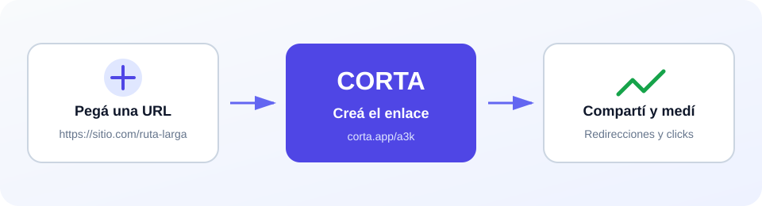

<p align="center">
  
</p>

<h1 align="center">Corta</h1>

<p align="center">
  Acortador de URLs con historial y estadísticas de uso.
</p>

<p align="center">
  <a href="https://corta-production-ea3e.up.railway.app/"><strong>Probar demo en vivo</strong></a>
  ·
  <a href="SPEC.md">Ver especificación</a>
</p>

Corta permite crear enlaces cortos, visitar el destino original y consultar cuántos clicks recibió cada enlace.



## Demo

La aplicación está publicada en [corta-production-ea3e.up.railway.app](https://corta-production-ea3e.up.railway.app/).

1. Pegá una URL que empiece con `http://` o `https://` y presioná **Acortar link**.
2. Copiá el enlace generado o abrilo desde el historial.
3. Visitá el enlace corto para comprobar la redirección; cada visita suma un click.
4. Elegí **Ver estadísticas** o ingresá el código en la [pantalla de estadísticas](https://corta-production-ea3e.up.railway.app/stats.html).

También podés probar la API desde una terminal:

```bash
# Crear un enlace corto
curl -X POST https://corta-production-ea3e.up.railway.app/api/links \
  -H "Content-Type: application/json" \
  -d '{"url":"https://example.com"}'

# Reemplazar CODIGO por el valor devuelto y consultar sus estadísticas
curl https://corta-production-ea3e.up.railway.app/api/links/CODIGO/stats
```

## Estado del proyecto

El repositorio parte de una aplicación heredada y se está llevando progresivamente a producción. [`SPEC.md`](SPEC.md) define el comportamiento esperado y funciona como fuente de verdad para la implementación y los tests.

En producción la aplicación usa PostgreSQL. En desarrollo local y en la suite de tests usa `corta/links.json`, para no necesitar una base levantada. El backend se elige solo según haya o no `DATABASE_URL`.

## Requisitos

- Node.js 20 o posterior.
- npm.

## Instalación

```bash
cd corta
npm install
```

## Ejecución local

```bash
npm start
```

Queda disponible en <http://localhost:3000>. El puerto se puede cambiar con `PORT`.

## Estructura

```text
.
├── SPEC.md             Especificación funcional y criterios de prueba
├── corta/
│   ├── public/         Interfaz web y estilos
│   ├── almacen/        Backends de almacenamiento (postgres.js y json.js)
│   ├── app.js          Rutas y lógica de la API (factory `crearApp`)
│   ├── server.js       Arranque HTTP y elección del backend
│   ├── links.json      Almacenamiento de desarrollo y tests
│   ├── test.js         Suite automatizada derivada de SPEC.md
│   └── utils.js        Generación de códigos cortos
└── README.md
```

## API

- `POST /api/links`: crea un enlace corto.
- `GET /api/links`: devuelve el historial ordenado por fecha de creación.
- `GET /api/links/:codigo/stats`: devuelve URL, fecha de creación y clics.
- `GET /:codigo`: redirige al destino y registra un clic.

El contrato completo, incluidos errores y casos borde, está documentado en [`SPEC.md`](SPEC.md).

## Configuración

Las variables de entorno esperadas están documentadas en [`.env.example`](.env.example). Los valores reales viven únicamente en la configuración de Railway. Los archivos `.env` y las credenciales reales no deben versionarse.

## Deploy

La aplicacion corre en Railway, en el proyecto `corta`, environment
`production`.

| Ajuste | Valor |
|---|---|
| Builder | Railpack |
| Root directory | `corta` |
| Start command | `npm start` |
| Healthcheck | `/` |
| Puerto | lo inyecta Railway en `PORT` |
| Base de datos | PostgreSQL (servicio `Postgres`) |
| Volumen | montado en `/data`, solo fallback |
| Deploy | automatico en cada push a `main` |

Si el auto-deploy no dispara, se puede deployar el directorio local con
`railway up` desde la raiz del repo (no desde `corta/`: el servicio ya tiene
`rootDirectory: corta`).

### Persistencia

El almacenamiento de produccion es **PostgreSQL**. `server.js` elige el backend
segun la presencia de `DATABASE_URL`:

| `DATABASE_URL` | Backend | Uso |
|---|---|---|
| presente | `almacen/postgres.js` | Produccion |
| ausente | `almacen/json.js` | Desarrollo local y tests |

En Railway, `DATABASE_URL` es una variable de referencia a
`${{Postgres.DATABASE_URL}}`, asi que apunta a la red privada del proyecto y no
hay credenciales en el repo.

El esquema se crea solo al arrancar (`CREATE TABLE IF NOT EXISTS`). `codigo` es
`PRIMARY KEY` porque [`SPEC.md`](SPEC.md) declara la unicidad como una
invariancia del sistema: con la restriccion en la base, una colision de codigo
falla de forma ruidosa en vez de duplicar o sobrescribir un enlace.

El volumen montado en `/data` queda como fallback del backend JSON. Ya no es el
camino de produccion, pero si se quita `DATABASE_URL` el servicio sigue
funcionando contra el archivo sin perder datos entre redeploys.

## Tests

La suite vive en `corta/test.js` y fue derivada de [`SPEC.md`](SPEC.md) con enfoque TDD.

```bash
cd corta
npm test
```

En PowerShell/Windows, usar `npm.cmd test`.

La suite cubre creación y validación de URLs, colisiones, concurrencia,
redirecciones, persistencia de clics, estadísticas y las dos interfaces web.

## Seguridad

Las credenciales viven únicamente en variables de entorno o en la configuración segura de la plataforma. Una nota heredada que contenía una credencial histórica fue retirada y ese valor no debe reutilizarse.

